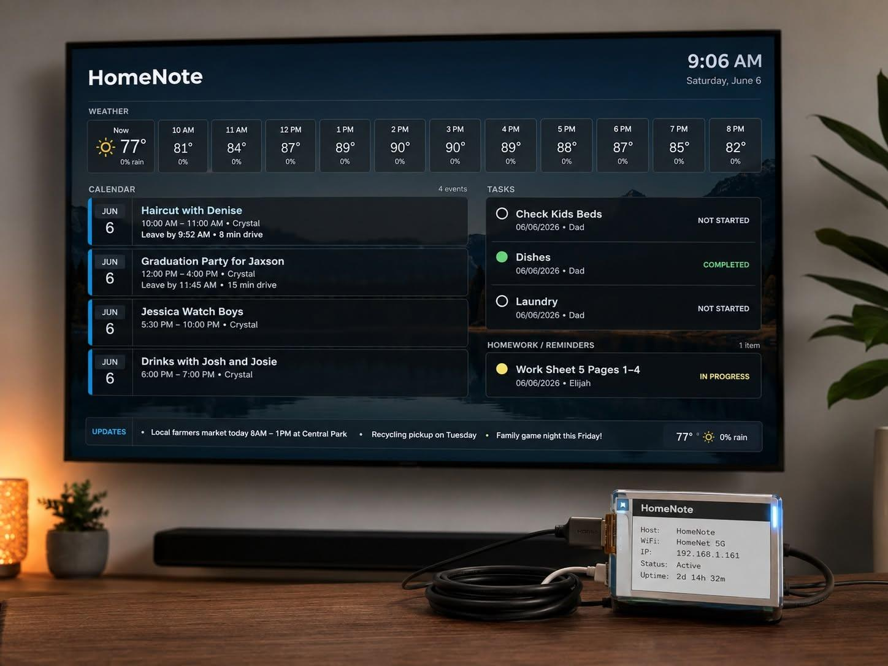

# HomeNote

HomeNote is a Raspberry Pi TV dashboard for a household calendar, tasks, homework, weather, rotating background images, and rotating news panels. It runs locally on the Pi and launches Chromium in kiosk mode after boot.

It was built for a Raspberry Pi Zero 2 W connected to a TV, with optional Waveshare 2.13-inch e-paper status display support.



## Features

- Full-screen TV kiosk with no scrolling
- Google Calendar iCal feed support
- Google Calendar API OAuth support for private/shared calendars
- Google Sheets task list support
- Separate homework sheet support
- Rolling 12-hour weather plus 7-day forecast from Open-Meteo
- Four rotating RSS news panels plus a daily market summary card
- Local rotating background images
- Browser settings panel for calendar, sheets, and location
- Optional e-paper status display showing hostname, IP, and service status

## Quick Start

1. Clone this repo to your computer or Raspberry Pi.
2. Copy `config.example.json` to `config.json`.
3. Replace the example Google Calendar and Google Sheet values with your own.
4. Install on the Pi:

```bash
sudo ./install-pi-kiosk.sh
```

5. Edit the live config:

```bash
nano ~/homenote/config.json
sudo systemctl restart homenote.service
```

6. Reboot:

```bash
sudo reboot
```

The dashboard runs at `http://localhost:8765` on the Pi.

Open the dashboard from another computer on the same network and use the gear icon to edit the calendar source, task/homework sheet IDs, timezone, travel buffer, and weather location without SSH.

## Google Calendar

HomeNote can read Google Calendar two ways: an iCal URL, or the Google Calendar API using your authorized Google account.

Use the Google Calendar API option when a shared calendar only works while you are logged in, such as:

```text
https://calendar.google.com/calendar/u/0/embed?src=shared-calendar@example.com
```

### Option 1: iCal URL

1. Open Google Calendar in a browser.
2. Click the gear icon, then **Settings**.
3. Select the calendar you want to show.
4. Under **Integrate calendar**, copy either:
   - **Secret address in iCal format** for a private calendar.
   - **Public address in iCal format** for a public calendar.
5. Paste that URL into `config.json`:

```json
"calendars": [
  {
    "name": "Family",
    "url": "https://calendar.google.com/calendar/ical/your-calendar/basic.ics",
    "color": "#4c91d9"
  }
]
```

You can add more than one calendar object.

### Option 2: Google Calendar API

1. Create an OAuth desktop client in Google Cloud and download it as `google-credentials.json`.
2. Put `google-credentials.json` in this project folder on your computer.
3. Install the Python requirements locally.
4. Run:

```powershell
python tools\google_calendar_auth.py --credentials google-credentials.json --token google-token.json
```

5. Sign in with the Google account that can see the shared calendar.
6. Copy both files to the Pi:

```powershell
scp google-credentials.json google-token.json pi@homenote.local:/home/pi/homenote/
```

7. Configure the calendar in `~/homenote/config.json`:

```json
"calendars": [
  {
    "name": "Family",
    "provider": "google_api",
    "id": "shared-calendar@example.com",
    "credentials_path": "/home/pi/homenote/google-credentials.json",
    "token_path": "/home/pi/homenote/google-token.json",
    "color": "#4c91d9"
  }
]
```

Restart HomeNote after editing config:

```bash
sudo systemctl restart homenote.service
```

## Google Sheets Tasks

HomeNote reads task and homework lists from Google Sheets CSV exports. Your sheet must be shared so the Pi can access it without signing in.

1. Open your Google Sheet.
2. Click **Share**.
3. Set access to **Anyone with the link can view**.
4. Copy the spreadsheet ID from the URL:

```text
https://docs.google.com/spreadsheets/d/SPREADSHEET_ID/edit
```

5. Put that ID in `config.json`.

For the first sheet/tab, `gid` is usually `0`.

```json
"task_sheet": {
  "sheet_id": "SPREADSHEET_ID",
  "gid": "0"
}
```

To find another tab's `gid`, click the tab in Google Sheets and look at the URL. The value after `gid=` is the tab ID:

```text
https://docs.google.com/spreadsheets/d/SPREADSHEET_ID/edit#gid=1669138132
```

Then configure homework:

```json
"homework_sheet": {
  "sheet_id": "SPREADSHEET_ID",
  "gid": "1669138132"
}
```

## Sheet Columns

Task sheet columns:

```text
Task, Owner, Start Date, Due Date, Priority, Status
```

Homework sheet columns:

```text
Homework, Child, Due Date, Status
```

Dates can be `MM/DD/YYYY`, `MM/DD/YY`, or `YYYY-MM-DD`.

Items are visible only when today is on or after the start date and on or before the due date. If there is no start date, the item is visible until the due date. If there is no due date, the item is visible after the start date.

Supported completed statuses include `Done`, `Complete`, `Completed`, `Finished`, `Closed`, `Yes`, and `True`.

`In Progress`, `In-Progress`, `Started`, and the common typo `In Progres` show as yellow.

## Config

Use `config.example.json` as the template. Important fields:

- `title`: dashboard title.
- `timezone`: IANA timezone such as `America/New_York`.
- `days_ahead`: number of calendar days to show.
- `travel_buffer_minutes`: extra leave-time buffer added to calculated drive time.
- `calendars`: Google Calendar iCal feeds.
- `task_sheet`: main task Google Sheet tab.
- `homework_sheet`: homework Google Sheet tab.
- `weather`: latitude and longitude.
- `news`: RSS feed and headline limit.
- `markets`: Stooq symbols for the market summary card.
- `tasks`: optional manual fallback tasks.
- `events`: optional manually configured events.

## Windows Deploy Helper

From Windows, you can deploy over SSH:

```powershell
.\deploy-pi.ps1 -Target "pi@homenote.local" -RemoteDir "/tmp/homenote-source"
```

Or use the Paramiko deploy helper:

```powershell
$env:HOMENOTE_PI_TARGET="homenote.local"
$env:HOMENOTE_PI_USER="pi"
$env:HOMENOTE_PI_PASSWORD="your-password"
python tools\deploy_paramiko.py
```

## Managing The Pi

Check the app:

```bash
systemctl status homenote.service
```

Restart the app:

```bash
sudo systemctl restart homenote.service
```

Restart the kiosk display:

```bash
sudo systemctl restart lightdm.service
```

View logs:

```bash
journalctl -u homenote.service -n 100 --no-pager
```

## Optional E-Paper Display

The installer enables SPI and creates:

- `homenote-epaper.service`
- `homenote-epaper.timer`

The display refreshes at boot and every 10 minutes. It is intended for a Waveshare 2.13-inch e-paper HAT V4, 250x122 black/white display.

## GitHub

This folder is ready to be committed as a normal git repo:

```bash
git init
git add .
git commit -m "Initial HomeNote dashboard"
git branch -M main
git remote add origin https://github.com/YOUR_USER/homenote.git
git push -u origin main
```
